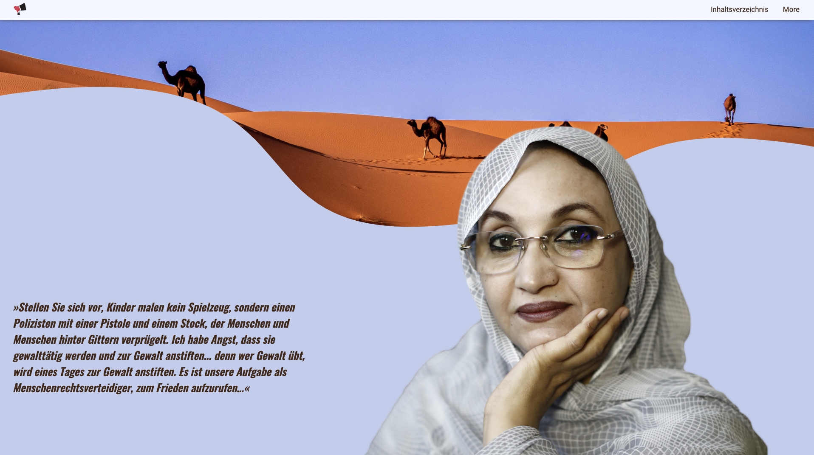

# Rebellinnen Project

## Description

In this project for my school I create a simple webpage for a important woman.  
This project has:

- a responsive layout

## Links

- [Live Preview](https://tomsoerr.github.io/rebellinnen/)
- Link to the [exhibition](https://www.ausstellung-leihen.de/rebellinnen)
- See my next [Project](https://github.com/TomSoerr/portfolio)
- Desert Photo from [Unsplash](https://unsplash.com/photos/kiYzznir-uo)
  Aminatou Haidar photo from [RightLivelihood](https://rightlivelihood.org/app/uploads/2019/09/aminatouportrait-1024x1024.jpg)
- Text from [Wiki](https://de.wikipedia.org/wiki/Aminatou_Haidar)
- and from [Amnesty](https://www.amnesty.de/informieren/aktuell/marokko-aminatou-haidar-meine-geschichte-ist-kein-einzelfall)
- Quote from Sandblast Arts, Dec. 14, 2009
